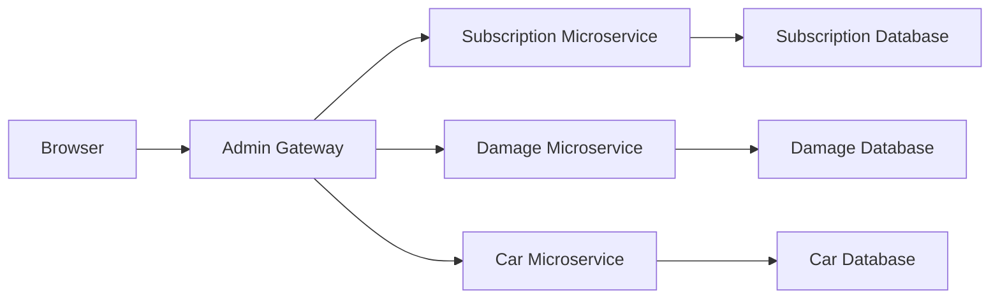

# Admin Gateway

## Table of Contents
1. [Overview](#overview)
   1. [Key Responsibilities](#key-responsibilities)
   2. [Roles Required](#roles-required)
2. [Architecture Diagram Snippet](#architecture-diagram-snippet)
3. [Features](#features)
4. [Technology Stack](#technology-stack)
5. [Environment Variables](#environment-variables)
6. [Routing Configuration](#routing-configuration)
7. [Endpoints](#endpoints)
   1. [Subscription Service](#subscription-service)
   2. [User Service](#user-service)
   3. [Damage Service](#damage-service)
   4. [Car Service](#car-service)

## Overview
**Service:** Admin Gateway  
**Description:** This gateway has access to all endpoints across all microservices in the system. As long as you are logged into an admin user, you control everything in the system.

### Key Responsibilities
- Load balancing and request forwarding.
- Centralized authentication and authorization.
- API rate limiting and logging (if applicable).

### Roles Required
- admin
- finance
- sales
- maintenance

## Architecture Diagram Snippet

## Features
- Reverse proxy for routing requests to services.
- Centralized API endpoint for the entire application.
- Swagger/OpenAPI documentation for the aggregated API endpoints.

## Technology Stack
- **Programming Language:** Python
- **Framework:** Flask
- **Routing Library:** Flask
- **API Documentation:** Swagger/OpenAPI
- **Deployment:** Azure Web App (Docker container)
- **CI/CD:** GitHub Actions

## Environment Variables

| Variable Name                  | Description                                 |
|--------------------------------|---------------------------------------------|
| `SECRET_KEY`                   | Secret key for Flask application            |
| `ABONNEMENT_MICROSERVICE_URL`  | URL for the subscription microservice       |
| `USER_MICROSERVICE_URL`        | URL for the user microservice               |
| `SKADE_MICROSERVICE_URL`       | URL for the damage microservice             |
| `CAR_MICROSERVICE_URL`         | URL for the car microservice                |

## Routing Configuration
The gateway uses a configuration file to define service endpoints and routes. The microservices' URLs are dynamically assigned based on environment variables. For instance, `ABONNEMENT_MICROSERVICE_URL`, `USER_MICROSERVICE_URL`, `SKADE_MICROSERVICE_URL`, and `CAR_MICROSERVICE_URL` are used to set the URLs for the subscription, user, damage, and car microservices respectively. 

The gateway handles requests for different HTTP methods (`GET`, `POST`, `PATCH`, `DELETE`). It constructs the full URL for the target microservice and forwards the incoming request with the appropriate HTTP method. 

If the requested service is not found in the configuration, it returns a 404 error. The request headers are adjusted to ensure that content types are correctly set for methods typically involving a request body. The gateway also forwards cookies for authorization and ensures that the response from the microservice is passed back to the client.

## Endpoints

### Base URL
- Local: http://localhost:5000
- Production (Azure): https://admin-gateway-fqevcraygyfvafe2.northeurope-01.azurewebsites.net

### Endpoint Documentation

#### Subscription Service
| Method | Endpoint | Description | Roles Required |
| ------ | -------- | ----------- | -------------- |
| GET | `/subscription/subscriptions` | Retrieve a list of subscriptions | admin, finance, sales |
| GET | `/subscription/subscriptions/<int:id>` | Retrieve a specific subscription by ID | admin, sales |
| GET | `/subscription/subscriptions/current` | Retrieve a list of current active subscriptions | admin |
| GET | `/subscription/subscriptions/current/total-price` | Retrieve the total price of current active subscriptions | admin, finance |
| GET | `/subscription/subscriptions/<int:id>/car` | Retrieve car information for a specific subscription by ID | admin, sales |
| POST | `/subscription/subscriptions` | Add a new subscription | admin, sales |
| PATCH | `/subscription/subscriptions/<int:id>` | Update an existing subscription | admin, sales |
| DELETE | `/subscription/subscriptions/<int:id>` | Delete a subscription by ID | admin, sales |

#### User Service
| Method | Endpoint | Description | Roles Required |
| ------ | -------- | ----------- | -------------- |
| POST | `/user/register` | Register a new user | none |
| POST | `/user/login` | Authenticate a user and return a token | none |
| GET | `/user/users` | Retrieve a list of all users | admin |
| PATCH | `/user/users/<int:id>` | Update email or password of a specific user | admin |
| PATCH | `/user/users/<int:id>/add-role` | Add a role to a specific user | admin |
| PATCH | `/user/users/<int:id>/remove-role` | Remove a role from a specific user | admin |
| DELETE | `/user/users/<int:id>` | Delete a user by ID | admin |
| GET | `/user/health` | Check the health status of the microservice | none |
| POST | `/user/logout` | Logout and delete the authorization cookie | none |

#### Damage Service
| Method | Endpoint | Description | Roles Required |
| ------ | -------- | ----------- | -------------- |
| GET | `/damage/damage-types` | Retrieve a list of all damage types | admin, finance, maintenance |
| GET | `/damage/damage-types/<int:id>` | Retrieve a specific damage type by ID | admin, maintenance |
| POST | `/damage/damage-types` | Add a new damage type | admin, maintenance |
| PATCH | `/damage/damage-types/<int:id>` | Update an existing damage type by ID | admin, maintenance |
| DELETE | `/damage/damage-types/<int:id>` | Delete a damage type by ID | admin, maintenance |

#### Car Service
| Method | Endpoint | Description | Roles Required |
| ------ | -------- | ----------- | -------------- |
| POST | `/car/cars` | Add a new car to the system | admin |
| GET | `/car/cars` | Retrieve a list of all cars | admin, maintenance |
| GET | `/car/cars/<int:id>` | Retrieve details of a specific car by ID | admin, maintenance |
| PATCH | `/car/cars/<int:id>` | Update details of a specific car (e.g., availability or kilometers driven) | admin, maintenance |
| DELETE | `/car/cars/<int:id>` | Delete a car by ID | admin |
| GET | `/car/cars/available` | Check the availability of all cars | admin, sales |
| GET | `/car/health` | Check the health status of the microservice | none |
